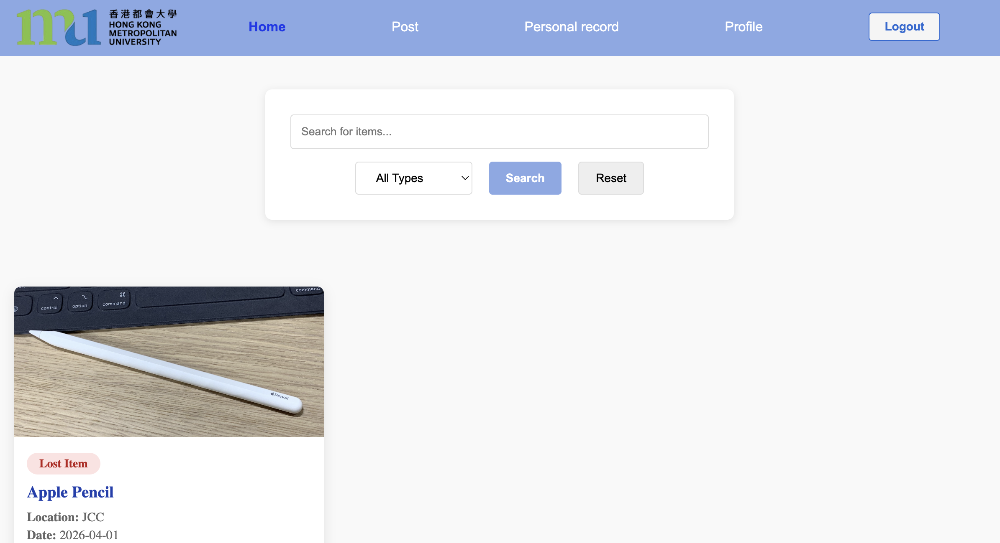

# IT1030SEF - Group Project (Group No.26)

  

# Campus Lost and Found Website

## Contents
- [System Overview](#overview)
- [Core Functions](#functions)
- [System Structure](#structure)
- [Installation](#installation)
- [User Guide](#userGuide)

## <a name="overview">System Overview</a>

The **Campus Lost and Found Website** is a web application designed for  students and staff to report and browse lost or found items on campus. The system uses browser `localStorage` for data persistence, allowing users to register, login, create posts, manage their own records, and search for items.

## <a name="functions">Core Functions</a>

1. User Authentication
   - Register a new account
   - Login and Logout

2. Create a Post
   - Choose between "Lost Item" or "Found Item"
   - Fill in item name, location, date, and description
   - Optionally provide an image or contact information

3. Browse and Search Posts
   - View all posts on the Home page, sorted from newest to oldest
   - Filter by post type (Lost / Found / All)
   - Search by keywords (item name, location, or description)

4. Manage Personal Records
   - Edit posts
   - Delete posts

5. User Profile
   - View logged in User ID
   - Logout from the Profile page

## <a name="structure">System Structure </a>

The system consists of the following HTML pages and corresponding JavaScript files:

| Module | Description |
|------|-------------|
| `index.html` | Home page displays all posts with search and filter functions |
| `login.html` | Login page for user authentication |
| `register.html` | Registration page for creating a new account |
| `Post.html` | Create a new lost or found item post |
| `pr.html` | Personal records to view, edit or delete user's own posts |
| `Profile.html` | User profile displays user ID and logout option |
| `common.js` | Navigation bar controller that dynamically updates the login/logout button based on user session state and provides shared authentication utilities |
| `home.js` | Home page logic including displaying posts, searching and filtering by type |
| `login.js` | Login logic and default user initialization |
| `register.js` | Registration logic |
| `post.js` | Post creation logic |
| `pr.js` | Personal records logic |
| `profile.js` | Profile page logic |
| `style.css` | Styling for all pages |

## <a name="installation">Installation</a>
No installation or server is required. This is a pure front-end application.

### Start the website:

1. Download all project files to a local folder
2. Ensure the following files are present:
   - HTML files: `index.html`, `login.html`, `register.html`, `Post.html`, `pr.html`, `Profile.html`
   - JavaScript files: `common.js`, `home.js`, `login.js`, `register.js`, `post.js`, `pr.js`, `profile.js`
   - CSS file: `style.css`
   - Images: `hkmu.png`, `building.jpg`
3. Open `login.html` or `index.html` in any modern web browser

> **Note:** Since the system uses `localStorage`, data is stored only in your browser. Clearing browser data will erase all posts and user accounts.

### Default Login Accounts (for testing):

| User ID | Password |
|---------|----------|
| s111    | Abcd1234 |
| s222    | Password123 |

## <a name="userGuide">User Guide</a>

### First Time Use
1. Open `login.html`
2. Click the "Register" link to create a new account
3. Enter a User ID and password
4. Click "Register" and then log in with your new account

### Login
1. Enter your User ID and password on the login page
2. Click the "Login" button
3. After successful login, the navigation bar will show "Logout" instead of "Login"

### Creating a Post
1. Make sure you are logged in
2. Click "Post" in the navigation bar
3. Select "Lost Item" or "Found Item" as the post type
4. Fill in the item name, location, date, and description
5. Optionally upload an image and provide contact information
6. Click "Submit Post" to publish
7. After submitting a post, you will be redirected to the "Home" page automatically

### Viewing Posts
1. Go to the "Home" page to view all posts
2. All posts are displayed as cards, sorted from newest to oldest
3. Each card shows the information of items
> **Note:** You can view all posts without logging in

### Searching and Filtering
1. On the Home page, type keywords into the search box to find items by name, location, or description
2. Use the dropdown menu to filter by "Lost Items", "Found Items", or "All Types"
3. Click "Reset" to clear all search and filter settings

### Managing Your Own Posts
1. Click "Personal record" in the navigation bar
2. You will see all posts you have created before
3. Click "Edit" to modify the item name, location, date, description, contact
4. Click "Delete" to remove a post

### Viewing Your Profile
1. Click "Profile" in the navigation bar
2. Your User ID will be displayed on the screen

### Logout
- Click the "Logout" button in the navigation bar, or
- Go to the "Profile" page and click the "Logout" button
